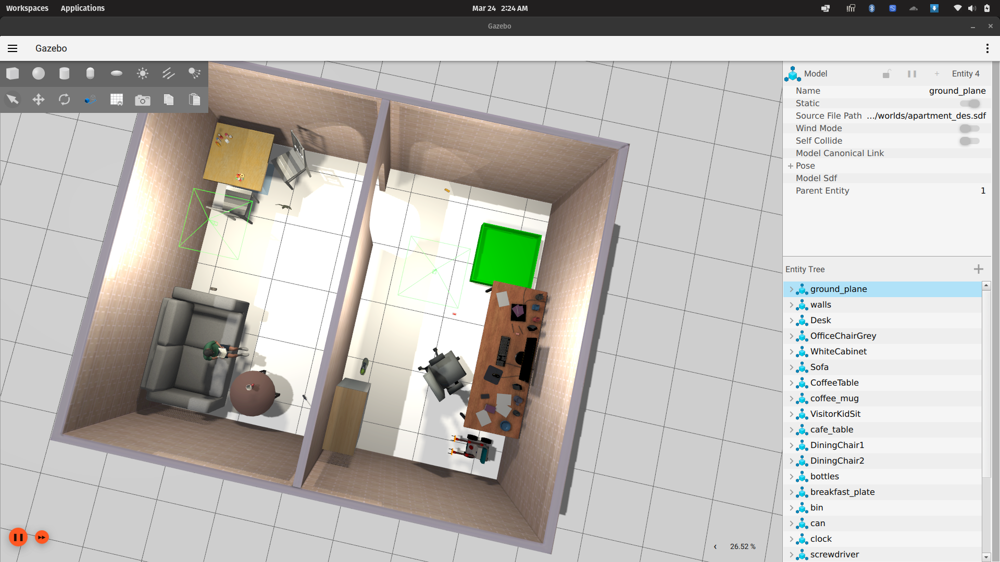
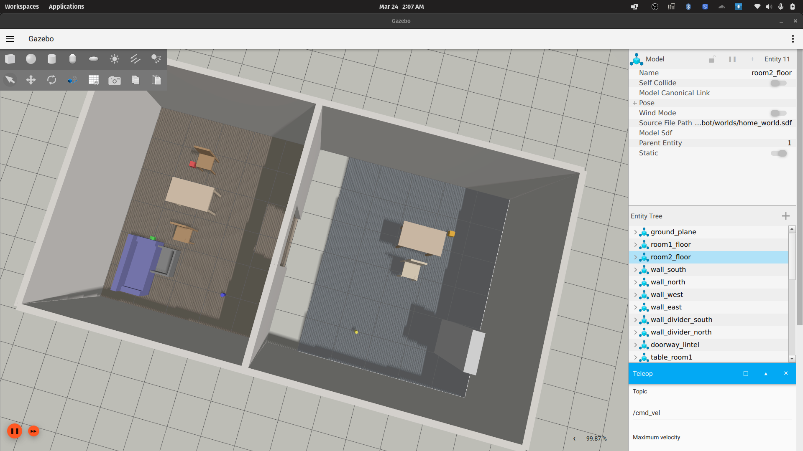

# Approach

## Robot Model

Built the robot model using **Blender** with the **Linkforge extension** to generate URDF files directly from the 3D model. This streamlined the process of converting visual assets into a simulation-ready format.

### Sensors
- Main camera (torso-mounted)
- LiDAR
- IMU
- Depth camera

### Assets
- **7 custom models**: Designed in blender and textured.
- **Remaining models**: Source from [Gazebo Fuel](https://app.gazebosim.org/fuel/models)

## Home Layout
Designed a living room and office/study environment with the following setup:

**Living Room**
- Dining table
- Sofa with a kid sitting on it
- Coffee table

**Office/Study**
- Large green collection bin
- Fully populated desk
- Cabinet
- Office chair

**Scattered Objects** (6 total)
- Dinosaur toy
- Bus toy
- Coca Cola can
- Screwdriver
- Shoe
- Desk clock

## Navigation Strategy

The robot uses pre-recorded waypoints captured through a separate teleop interface. These waypoints define the navigation path through the home environment, allowing the robot to autonomously follow the recorded trajectory during task execution.

## Tradeoffs & Improvements

### Tradeoffs Made

- **Abandoned pick and place tasks**: Navigation constraints made reliable object manipulation infeasible, so focus shifted to navigation and environment interaction only.
- **Pre-recorded waypoints over dynamic planning**: Simplified implementation and ensured reproducible trajectories, though reduced adaptability.
- **Gazebo Fuel models for non-custom assets**: Balanced development time against fully custom environments.

### Future Improvements

- **Dynamic navigation system**: Implement real-time path planning with obstacle avoidance to replace pre-recorded waypoints
- **Object detection integration**: Add vision-based object recognition to enable autonomous task selection
- **Pick and place functionality**: Develop full manipulation pipeline with grasp planning and motion control
- **Enhanced robot model**: Replace remaining Gazebo Fuel models with custom meshes for improved visual and physical fidelity

## Debugging Challenges

- **Physical Properties Debugging**: The most difficult part in the world creation process was fixing the ideal physical properties to provide each object and environment, as there are many constraints based on the models used for the robot and the items.

- **Sensor Locations and orientation**: This is a simpler debugging problem as the output from the sdf could be analysed to see what direction the robot sensing is pointing in.

- **Controllers**: After many hours of debugging the mimic joints, the gazebo diff-drive plugins, sensor plugins, and the ros2 control controllers, i was able to get the robot to move properly without bugging out every 2s. The robot would not move properly due to small issues like missed mass in the finger, the joints would bend unnaturally due to malformed constraints and the controller would just stop working in between tests. Most of the solutions were pretty straight forward.
 
 - **Waypoint navigation**: The world having realistic values and the robot also being provided with the friction on wheels, there was a lot of drift involved which only got fixed after I reduced the error tolerences, refactored the code to identify the main problems.

## Comparison between drift AI and My simulation
My Simulation:
 

Drift's Simulation

### Key ways mine is better that drift's:

 - **Robot Spawn**: The robot spawns correctly in my simulation and also at the correct location.

 - **Lighting**: I have implemented directional lighting which looks like a overhead light we usually see in rooms rather that sticking to generic ways to illuminate locations.

- **Models**: From the robot model to every other asset in my simulation is either cherry picked or custom created to follow a deliberate theme, with the whole scene looking proper. The drift simulation just created assets usign boxes and there is collision between the collection basket and the sofa too.

- **Ground breaking**: The drift simulation just keeps empty space at some ground locations, making the robot fall if the hole is big enough.

## Videos of Errors while using Drift:

1. First prompt does not successfully generate the whole scene and just prints out Hello World. The videos folder contains all the videos of the issue and a sample simulation from my side too!